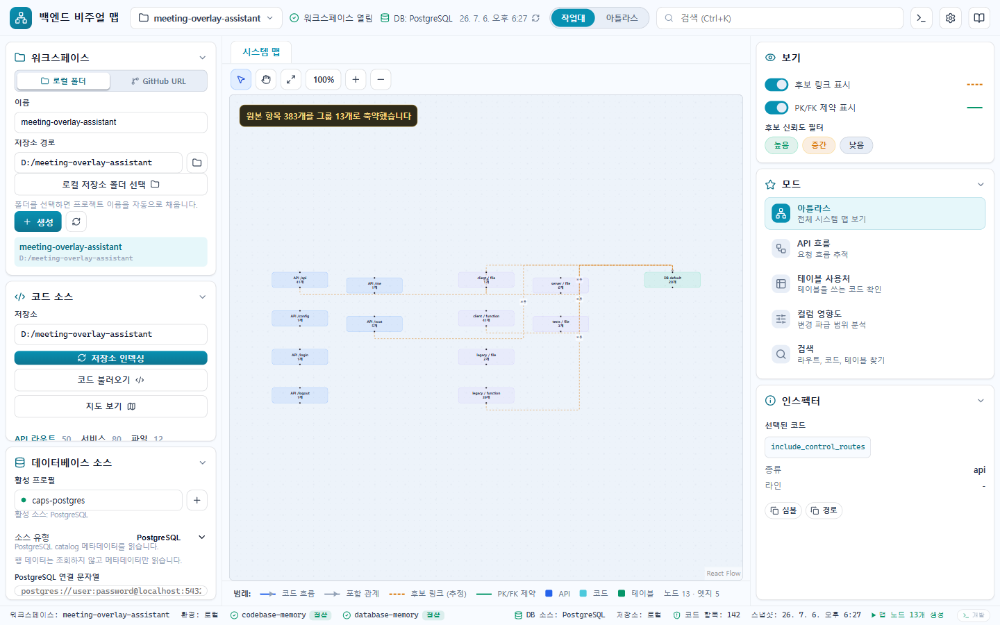

# Backend Visual Map

백엔드 코드와 관계형 데이터베이스 메타데이터의 관계를 **근거와 함께** 탐색하는 Windows 우선 Tauri + React 데스크톱 앱입니다.



## Why it exists

큰 백엔드 저장소에서 "이 API가 어떤 테이블과 컬럼에 영향을 주는가?"를 코드·스키마를 오가며 추적하는 비용을 줄입니다. raw dependency graph를 그대로 던지지 않고, Workbench와 Atlas에서 API Flow, Table Usage, Column Impact를 focused view로 보여줍니다.

**Product boundary:** row data는 읽지 않고, DB 비밀번호·토큰·연결 secret은 workspace 파일에 저장하지 않습니다.

## What it does

- local folder 또는 GitHub URL로 workspace 생성 후 코드 인덱싱
- SQLite, SQLite DDL, PostgreSQL, YugabyteDB YSQL, MySQL, MariaDB, SQL Server, Oracle 메타데이터 인덱싱
- 고정 내비게이션에서 전체 구조, API 읽기 경로, 코드, DB 구조, 변경 영향을 focused view로 탐색
- API·코드·파일·테이블·컬럼 중 2~8개를 골라 전체 연결, 호출, 데이터, 영향 관계만 조합해 보기
- 실행 호출에 직접 연결된 정적 SQL을 근거로 `READS`, `WRITES`, `USES_COLUMN` 관계 확인
- 확정 근거, 후보, 미확인 영역과 분석 범위를 구분해 표시
- codebase-memory `0.9.0`과 database-memory `0.2.0 / contract 2`를 bundled sidecar로 실행

## Quick start

소스에서 실행하려면 다음 명령을 사용합니다. 엔진 실행 파일은 Git에 포함하지 않으므로 최초 한 번 준비해야 합니다.

```powershell
npm ci
cargo +1.96.1 build --locked --release -p database-memory-cli --manifest-path ..\db_mcp\Cargo.toml
Copy-Item ..\db_mcp\target\release\database-memory.exe .\src-tauri\engines\database-memory.exe -Force
powershell -NoProfile -ExecutionPolicy Bypass -File scripts/prepare-engines.ps1 -AllowDevelopmentArtifact
npm run tauri dev
```

DB 엔진 `0.2.0` 공개 바이너리는 아직 배포하지 않았으므로, 위 명령은 함께 checkout한 `db_mcp` 소스의 고정 commit `35ed83de33e51eef74a5276c625cb03b24e020c4`를 빌드합니다.

앱에서는 다음 순서로 연결합니다.

1. `소스 관리`에서 로컬 폴더 또는 GitHub URL을 선택하고 프로젝트를 엽니다.
2. `코드 읽기`를 누르면 인덱싱과 API·함수·클래스·파일 목록 로드를 한 번에 수행합니다.
3. DB가 필요하면 연결 이름과 소스를 저장한 뒤 `DB 읽기`를 누릅니다.
   - SQLite/SQLite DDL은 파일 또는 디렉터리 경로를 사용합니다.
   - PostgreSQL, YugabyteDB YSQL, MySQL, MariaDB, SQL Server, Oracle 연결 문자열은 해당 읽기 실행에만 사용합니다. Oracle은 별도 Oracle Client 11.2 이상이 필요합니다.
4. 고정 왼쪽 메뉴에서 `개요`, `API`, `코드`, `데이터베이스`, `변경 영향`을 오가며 근거를 확인합니다.
5. 여러 대상을 함께 보려면 `관계`에서 2~8개를 고르고 `전체 연결`, `호출`, `데이터`, `영향` 중 하나를 선택합니다.

내부 설치본은 `npm run build:internal`로 생성할 수 있으며, 설치 앱에는 두 엔진이 함께 포함됩니다. 이 저장소는 소스와 로컬 빌드를 공개하며 공식 installer binary는 배포하지 않습니다.

## Develop and verify

```powershell
npm run deadcode
npm test -- --run
npm run typecheck
npm run build
cargo fmt --manifest-path src-tauri/Cargo.toml -- --check
cargo clippy --locked --manifest-path src-tauri/Cargo.toml --all-targets -- -D warnings
cargo test --locked --manifest-path src-tauri/Cargo.toml
```

## 엔진 바이너리

내부/릴리스 빌드는 엔진을 `src-tauri/engines`에서 Tauri resource로 포함합니다.

- `src-tauri/engines/codebase-memory-mcp.exe`
- `src-tauri/engines/database-memory.exe`

설치 후 앱은 설치 디렉터리의 bundled resource를 우선 사용하므로 사용자가 PATH를 설정할 필요가 없습니다.

로컬 개발 중에는 `BACKEND_VISUAL_MAP_ENGINE_DIR`로 엔진 폴더를 지정할 수 있습니다.

엔진은 앱 내부 sidecar로만 사용합니다. Codex, Claude, 또는 다른 AI 도구에 MCP 서버로 자동 등록하지 않습니다.

## 설치 파일 범위

```powershell
# 로컬 내부 검증용
npm run build:internal

# 공개 배포용: MIT 라이선스, 공개 엔진, 고지와 dependency inventory를 검증합니다.
npm run tauri build
```

내부 설치본은 실행 중 `internal` 엔진 모드를 표시합니다. 이 저장소는 소스 공개와 로컬 빌드만 제공하며 Windows 설치 파일을 공식 배포하지 않습니다.

### 제품 검증

```powershell
# 실제 Java, C#/.NET, Python/FastAPI + TypeScript monorepo를 고정 commit으로 검증
npm run smoke:code-matrix

# 로컬 검증 설치본의 형식, 엔진, notices, checksum 검증
powershell -File scripts/release-smoke.ps1

```

제품 소스는 MIT입니다. 현재 코드는 `database-memory 0.2.0 / contract 2`의 고정 source commit과 candidate checksum을 사용하며 `releaseReady=false`로 공개 설치본 생성을 차단합니다. 공개 `v0.2.0` 바이너리를 게시하고 같은 checksum을 검증하기 전까지는 로컬/내부 빌드만 허용합니다.

## 개인정보와 데이터 접근

앱은 로컬 메타데이터 인덱싱을 기준으로 설계되어 있습니다.

- DB row data를 읽지 않습니다.
- DB 비밀번호/토큰/연결 secret을 워크스페이스 파일에 저장하지 않습니다.
- DB 연결 문자열은 네트워크 DB 인덱싱 실행 중 세션 입력으로만 사용합니다.
- 저장되는 파일은 워크스페이스 설정, engine cache 경로, 인벤토리 스냅샷입니다.
- code-to-DB 관계는 직접 증거가 없는 한 후보(candidate)로 표시합니다. 확정 관계는 실행 호출에 직접 전달된 정적 SQL과 유일하게 식별된 테이블/컬럼이 있을 때만 만듭니다.
- 코드 CALLS는 직접 FastAPI import 근거로 보강된 경우 또는 엔진 신뢰도 85% 이상만 확정 경로에 포함하며, 70~84%는 후보, 그 아래나 점수 없음은 미확인으로 분리합니다.

## 제한사항

- raw full graph를 그대로 렌더링하지 않습니다. 큰 프로젝트는 grouped/focused map으로 축약합니다.
- 외부 DB smoke는 로컬 환경에 해당 DB와 드라이버/연결 문자열이 있을 때만 통과할 수 있습니다.
- SQLite DDL 입력에 지원하지 않는 문법이 있으면 완전한 결과로 가장하지 않고 읽기를 실패 처리합니다.
- 동적 SQL과 ORM 생성 쿼리는 직접 실행 근거로 확정하지 않으며 후보 또는 미확인으로 남깁니다.
- 공식 Windows 설치 파일 배포는 현재 제품 범위가 아닙니다.
- 현재 제품 목표는 Windows desktop입니다.

## 문서

- [리서치](docs/research/backend-visual-map.md)
- [완성 제품 기준](docs/plans/backend-visual-map-final-product.md)
- [현재 제품 완성 기록](docs/plans/backend-visual-map-production-completion.md)
- [신뢰성과 UX 검증](docs/plans/product-trust-ux-completion.md)
- [제품 지원 범위와 확정 근거 규칙](docs/product-support.md)
- [백엔드 개발자 사용성 테스트 절차](docs/usability-test-protocol.md)
- [3분 데모](docs/demo/backend-visual-map.demo.md)
- [문제 해결](docs/troubleshooting.md)
- [리포트 규칙](docs/reports/README.md)
