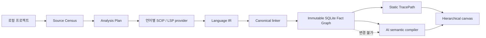

# Codebase Workspace

> 코드를 직접 전부 읽기 전에, 프로젝트의 구조와 실행 관계를 근거와 함께 빠르게 파악하는 로컬 개발자 도구입니다.

Codebase Workspace는 로컬 코드베이스를 정적 분석해 검증 가능한 Fact Graph로 만들고, 설치된 Codex 또는 Claude CLI를 이용해 그 사실 위에 영역 이름과 짧은 설명을 더합니다. 제품이 사용자의 작업 방식을 정하지는 않습니다. 같은 지도를 보고 온보딩, 기능 개발, API 설계, 디버깅, 리팩터링 검토 등 필요한 가치를 사용자가 직접 찾는 것이 제품 원칙입니다.

> **현재 상태**
>
> 코드 전용 vertical slice는 폴더 선택부터 정적 분석, canonical SQLite bundle, AI 의미 분석, Fluent 기반 지도 표시까지 연결되어 있습니다. 구형 JSON/architecture/collector 출력은 제거되어 실행 경로가 canonical 하나로 통합됐습니다. 아직 일반 배포용 완성본은 아니며, 대형 저장소 실측 최적화, 계층형 의미 통합, DB 통합과 앱 내 대화가 남아 있습니다.

## 제품 원칙

- **빠른 정보 제공**: 도구는 사실과 구조를 보여주고, 사용 목적은 강제하지 않습니다.
- **정적 사실 우선**: 파일, 정의, 호출, 타입, route, test 관계와 위치는 정적 분석기가 소유합니다.
- **AI는 의미만 보강**: AI는 기존 Fact ID만 사용해 영역 이름, 책임, 요약을 제안하며 사실을 바꾸지 못합니다.
- **모르면 비워 둠**: 동적 호출, 모호한 대상, 미지원 범위는 그럴듯한 선이 아니라 typed gap으로 남깁니다.
- **근거 없는 확정 관계 0개**: confirmed 관계에는 source evidence가 반드시 필요합니다.
- **로컬 우선**: workspace, Fact Graph, 의미 revision은 로컬에 저장됩니다. 분석용 AI 호출은 일회성이며 채팅 세션으로 남기지 않습니다.

## 분석 흐름


```mermaid
flowchart LR
    A["로컬 프로젝트"] --> B["Source Census"]
    B --> C["Analysis Plan"]
    C --> D["언어별 SCIP / LSP provider"]
    D --> E["Language IR"]
    E --> F["Canonical linker"]
    F --> G["Immutable SQLite Fact Graph"]
    G --> H["Static TracePath"]
    G --> I["AI semantic compiler"]
    H --> J["Hierarchical canvas"]
    I --> J
    G -. "변경 불가" .-> I
```

정적 분석 결과가 권위 있는 원본입니다. AI 결과는 동일한 Fact Graph에서 다시 만들 수 있는 파생 revision이며, 실패해도 마지막으로 검증된 Fact snapshot을 덮어쓰지 않습니다.

## 현재 가능한 것

| 영역 | 현재 상태 |
| --- | --- |
| 로컬 workspace | 폴더 연결, provider/model/추론 강도 저장 |
| 정적 코드 분석 | 10개 언어, source/config/provider 근거와 typed coverage |
| 코드 관계 | import/export, call/construct, type hierarchy/use, framework route/handler, test 관계 |
| Fact Graph | 결정적 ID, evidence, gap, immutable SQLite bundle, tamper 검증 |
| 실행 흐름 | confirmed direct edge만 사용하는 bounded `TracePath` |
| AI 의미 분석 | L0/L1 영역 이름·책임·요약, 규모별 동적 분할, 독립 검증·캐시, 짧은 별칭 기반 전역 통합 |
| UI | Fluent 2 기반 단일 workspace와 계층형 코드 지도 |
| DB | metadata-only 엔진은 남아 있으나 새 지도 ingestion은 아직 연결하지 않음 |
| 대화 | 제품 목표에는 포함되지만 현재 vertical slice에는 연결하지 않음 |

## 지원 언어

현재 정적 계약은 다음 10개 언어로 고정되어 있습니다.

`TypeScript` · `JavaScript` · `Python` · `Java` · `C#` · `C` · `C++` · `Go` · `Rust` · `Dart`

언어별 SCIP/compiler/LSP provider와 독립적인 CST 검증을 조합합니다. provider가 없거나 정확한 compile context를 만들 수 없는 경우 성공으로 위장하지 않고 누락 범위를 기록합니다. Ruby, PHP, Swift는 현재 제품 계약에 포함되지 않습니다.

## 신뢰 경계

- 분석 대상 애플리케이션 코드를 임의로 실행하지 않습니다.
- DB row 데이터는 읽지 않습니다.
- source range와 파일 digest가 맞지 않는 evidence는 폐기합니다.
- 이름이나 가까운 폴더만으로 관계 대상을 연결하지 않습니다.
- 분석 중 source가 변경되면 혼합 snapshot을 공개하지 않습니다.
- AI 출력은 기존 Fact/Region/Evidence ID만 참조할 수 있습니다.
- 취소·실패·검증 실패는 이전에 게시된 snapshot을 보존합니다.

## 개발 환경

현재 개발·패키징 기준은 Windows x64입니다.

- Node.js `24.18.0`
- Rust `1.96.1` (`x86_64-pc-windows-msvc`)
- npm
- Visual Studio C++ Build Tools
- 의미 분석을 사용할 경우 설치·인증된 Codex 또는 Claude CLI

```powershell
git clone https://github.com/shinyeonjun/visual_map.git
cd visual_map
npm ci
```

로컬 sidecar를 빌드하고 앱이 읽는 위치에 배치합니다.

```powershell
cargo build --locked --release --manifest-path code_memory/rust/Cargo.toml
cargo build --locked --release -p database-memory-cli --manifest-path db_memory/Cargo.toml

Copy-Item code_memory/rust/target/release/code-memory-language.exe `
  src-tauri/engines/code-memory-language.exe -Force
Copy-Item db_memory/target/release/database-memory.exe `
  src-tauri/engines/database-memory.exe -Force

npm run verify:engines
npm run tauri dev
```

`src-tauri/engines/*.exe`, provider runtime, analysis cache와 bundle은 소스 형상관리에 포함되지 않습니다.

## 검증

빠른 기본 검증:

```powershell
npm run typecheck
npm test
npm run lint
npm run deadcode
npm run format:check
npm run build

cargo fmt --manifest-path code_memory/rust/Cargo.toml -- --check
cargo clippy --manifest-path code_memory/rust/Cargo.toml --all-targets -- -D warnings
cargo test --locked --manifest-path code_memory/rust/Cargo.toml

cargo test --locked --manifest-path crates/fact-model/Cargo.toml
cargo test --locked --manifest-path crates/semantic-model/Cargo.toml
cargo test --locked --manifest-path crates/semantic-compiler/Cargo.toml
cargo test --locked --manifest-path src-tauri/Cargo.toml --lib
cargo clippy --manifest-path src-tauri/Cargo.toml --all-targets -- -D warnings
```

DB 엔진을 변경한 경우:

```powershell
cargo test --locked --manifest-path db_memory/Cargo.toml --workspace
```

10개 언어의 실제 근거·결정성 gate는 [Code Memory README](code_memory/README.md)에 정리되어 있습니다. fixture의 100% 수치는 닫힌 검토 corpus 결과이며 임의의 실제 저장소 전체 정확도 100%를 뜻하지 않습니다.

## 저장소 구조

```text
src/                         React + Fluent 2 desktop shell
src-tauri/src/               workspace, sidecar, Fact import, AI broker, map API
crates/fact-model/           provider/UI/AI와 독립적인 정적 Fact 계약
crates/semantic-model/       provider-neutral AI input/output/revision 계약
crates/semantic-compiler/    prompt, packet, partition, strict verifier
code_memory/                 10개 언어 정적 코드 분석 엔진
db_memory/                   metadata-only 관계형 DB 엔진
docs/                        현재 architecture, security, cleanup 계획
scripts/                     build, verification, packaging, cleanup scripts
```

## 현재 엔지니어링 상태

- 실행 경로는 `Source Census → Analysis Plan → Language IR → canonical SQLite` 하나입니다.
- `index_project()`와 Language IR unit emission은 단계별 coordinator/helper로 분리됐습니다.
- desktop map/selection은 전체 snapshot을 `Vec`으로 적재하지 않고 고정된 SQLite query를 사용합니다.
- 분석 취소는 정적 sidecar와 같은 분석에 속한 병렬 AI 자식 프로세스를 함께 종료합니다.
- 앱 workspace 삭제는 앱 데이터만 지우며 선택한 원본 코드 폴더는 건드리지 않습니다.

남은 구조 작업과 측정 완료 조건은 [Engineering cleanup roadmap](docs/engineering-cleanup-roadmap.md)에 고정합니다.

## 문서

- [문서 인덱스](docs/README.md)
- [Runtime architecture](docs/architecture.md)
- [Engineering cleanup roadmap](docs/engineering-cleanup-roadmap.md)
- [Security and privacy](docs/security-privacy.md)
- [Code Memory engine](code_memory/README.md)
- [Database Memory engine](db_memory/README.md)

## 라이선스

[MIT](LICENSE) · 배포 시 [Third-party notices](THIRD_PARTY_NOTICES.md)를 함께 확인하세요.
