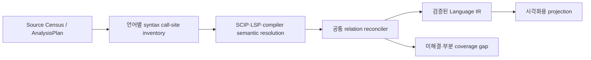

# 시각화용 정적 관계 분석 — 근본 원인·해결 가능성 진단

> 역사적 감사 스냅샷입니다. 정답표는 측정 근거 보존용이며, 삭제된
> JSON-output gate를 다시 제품 경로로 복구하라는 계약이 아닙니다. 현재 검증은
> `LANGUAGE-SEMANTICS.md`와 canonical 10언어 gate를 따릅니다.

상태: **근본 수정 구현 완료 / closed strict gate 10개 언어 통과**

기준일: 2026-08-07
측정 원본: `tests/ground_truth/semantic-core.v2.json` 및
`build/semantic-ground-truth/semantic-quality-report.json`

## 구현·재측정 결과

진단에서 제시한 세 구조 결함을 실제 엔진에서 수정했다.

1. C#/C/C++/Go/Rust source를 tree-sitter CST로 읽어 실제 call/construct 위치를 먼저 수집한다.
2. provider target은 그 위치에만 결합하고, 한 위치에 concrete/abstract target이 중복되면 유일하게
   증명되는 target 하나만 남긴다. 선언 위치 relation은 `CALLS`가 아니라 provider 내부
   `IMPLEMENTATION` 또는 raw `REFERENCES`로 낮추며, generic reference 자체는 제품 Language IR에
   영속하지 않는다.
3. C와 C++ provider execution scope를 분리하고 같은 header를 `(language, path)` 별도 document로
   보존한다.
4. constructor를 `CALLS`와 구별되는 `CONSTRUCTS`로 정규화하고 v2 정답표가 kind까지 대조한다.

release engine을 격리 cache에서 cold/warm 2회 실행한 현재 결과는 TP 35, FP 0, FN 0,
precision/recall/F1 100%, source coverage 25/25, evidence validity 100%, determinism 10/10,
weakest-language trust 100/100이다. 이는 고정된 지원 construct corpus의 결과이며 임의 repository의
동적 실행까지 100% 해석한다는 뜻은 아니다.

핵심 구현 위치:

- `rust/src/providers/call_sites.rs` — CST 기반 source call-site denominator
- `rust/src/providers/scip/reconcile.rs` — syntax/provider reconciliation과 one-site/one-target
- `rust/src/providers/lsp/runner.rs` — provider omission 위치의 exact definition 보완 질의
- `rust/src/static_pipeline/provider_schedule.rs` — C/C++ semantic context 분리
- `rust/src/provider_batch.rs` — 공유 header의 `(language, path)` 보존
- `tests/ground_truth/semantic-core.v2.json` — `CALLS`/`CONSTRUCTS` kind-aware 정답표

## 기술 요약

현재 “100%”인 TypeScript, JavaScript, Python, Java, Dart는 **각 언어 전체가 100%라는 뜻이 아니다.**
수동으로 전수 검토한 25개 fixture source file의 project-local `CALLS` 35건 중, 해당 다섯 언어에
포함된 19건을 모두 맞혔다는 뜻이다. 새로운 문법·framework·동적 호출까지 보장하지 않는다.

수정 전 나머지 5개 언어에서 측정된 오류 8건(FP 5, FN 3)과 C source coverage 누락 1건은 fixture
범위에서는 모두 해결 가능한 공학 문제다. 언어별 정답 문자열을 덧붙일 문제가 아니라 아래 세 가지
구조 결함으로 압축된다.

1. provider가 준 `CALLS`를 source syntax로 재검증하지 않고 모두 `confirmed`로 승격한다. 현재 FP
   5건 전부가 이 경로를 통과했다(현재 수정됨).
2. source에 존재하는 call site를 먼저 전수 수집하지 않는다. provider가 occurrence를 누락하면 보완할
   기준점이 없어 FN 3건 전부가 그대로 사라졌다(현재 수정됨).
3. C/C++ provider job이 공유 header의 서로 다른 compile context를 하나로 합친다. 그 결과 `types.h`가
   C++로만 index되고 C 측정에서는 누락됐다.

따라서 근본 해법은 **공통 Call-Site Reconciler**다. 모든 언어가 같은 단계와 불변식을 사용하고,
언어별 코드는 syntax와 semantic provider 차이만 번역해야 한다.



임의의 실제 project에서 동적 dispatch와 runtime metaprogramming까지 정적으로 100% 맞히는 것은 불가능하다.
JavaScript의 runtime property lookup, Python의 monkey patching, Rust trait object의 실제 implementation
선택처럼 실행 시점에만 결정되는 영역은 잘못된 confirmed edge를 만드는 대신
`unresolved/dynamic`으로 남겨야 한다. 이는 실패를 숨기는 것이 아니라 정적 사실층의 정확성을 지키는
제품 동작이다.

### 2026-08-07 지원 범위 결정

PHP와 Ruby는 active support에서 제거했다. provider, framework pack, fixture, packaging, release gate를
함께 제거했으며 아래 진단은 이제 10개 언어만을 구현 대상으로 삼는다. 이유는 단순히 “동적 언어라서”가
아니라 현재 provider 품질과 근본 보정 비용이 동일 신뢰도 기준에 맞지 않았기 때문이다. JavaScript와
Python도 동적 언어지만 active contract에 남아 같은 fail-closed 품질 gate를 적용받는다.

## 최종 시각화에 필요한 범위만 분석한다

이번 진단은 범용 IDE나 모든 language feature 지원을 목표로 하지 않는다. 정적 엔진이 최종 지도와
drill-down에 공급해야 하는 최소 사실은 다음과 같다.

- folder/package/module/type/function의 containment와 definition 위치
- project 내부의 직접 `CALLS`와 `CONSTRUCTS`
- package/module import
- extends/implements/override와 dispatch 종류
- API endpoint → handler/service/repository/DB로 이어지는 증거 기반 연결
- DB table read/write, queue/cache/external API 경계
- 각 node/edge를 클릭했을 때 보여줄 정확한 file/range와 coverage/gap

다음 데이터는 기본 시각화 사실층에서 제외한다.

- local variable와 parameter를 독립 node로 만드는 것
- primitive field access와 단순 symbol reference 전부
- standard-library call과 일반 dependency 내부 call
- source evidence 없이 이름만 같은 target
- runtime에서만 결정되는 target을 하나의 confirmed edge로 추측하는 것

단, project 내부 call은 화면에 모두 직접 그리지 않더라도 영역 간 edge 집계, flow 설명, drill-down에
사용되므로 정적 사실층에 보존한다. 노이즈 제거는 분석 생략이 아니라 **canonical fact → visualization
projection** 단계에서 수행한다.

## 수정 전 측정 결과와 오류 분해 (역사 기준선)

측정 분모는 수동 검토한 project-local call 35건이다. 전체 language 정확도나 framework 정확도가 아니다.

| 언어 | TP | FP | FN | precision | recall | 직접 확인한 증상 |
| --- | ---: | ---: | ---: | ---: | ---: | --- |
| TypeScript | 4 | 0 | 0 | 100% | 100% | 현재 fixture 통과 |
| JavaScript | 3 | 0 | 0 | 100% | 100% | 현재 fixture 통과 |
| Python | 4 | 0 | 0 | 100% | 100% | 현재 fixture 통과 |
| Java | 4 | 0 | 0 | 100% | 100% | 현재 fixture 통과 |
| C# | 3 | 0 | 1 | 100% | 75% | generic constructor occurrence 누락 |
| C | 1 | 0 | 1 | 100% | 50% | inline header call 및 C header coverage 누락 |
| C++ | 3 | 2 | 1 | 60% | 75% | constructor evidence token 오류, declaration을 call로 출력 |
| Go | 3 | 1 | 0 | 75% | 100% | 같은 call site에 display-name variant target 중복 |
| Rust | 3 | 2 | 0 | 60% | 100% | trait/impl target 중복, impl binding을 call로 출력 |
| Dart | 4 | 0 | 0 | 100% | 100% | 현재 fixture 통과 |

합계는 TP 32, FP 5, FN 3, precision 86.49%, recall 91.43%, F1 88.89%, source coverage
24/25 = 96.00%다.

### 원인 A — provider relation을 사실로 바로 승격한다

`static_pipeline/language_ir/adapter.rs`는 provider relation의 path/range 형식만 읽을 수 있으면
`FactTruth::Confirmed`로 만든다. range가 실제 call expression의 callee token인지, declaration인지,
constructor인지, 한 call site에 target이 여러 개인지 확인하지 않는다.

이 결함이 설명하는 현재 오류:

- C++ FP 2: constructor declaration과 local variable `box` 위치가 call evidence로 승격됨
- Go FP 1: 같은 `ID()` 위치에 `(User).ID`와 `ID`를 별도 confirmed target으로 저장
- Rust FP 2: 같은 `id()` 위치의 trait/impl 중복과 implementation binding 오분류

### 원인 B — canonical call-site inventory가 없다

현재 SCIP path는 occurrence가 있을 때 source 뒤에 `(`가 있는지 보는 문자열 heuristic으로 `CALLS`를
정한다. LSP path는 document symbol마다 `callHierarchy/outgoingCalls`를 질의하고, 일부 언어에만 단순
lexical fallback을 적용한다. source 전체의 call expression을 먼저 세지 않으므로 provider omission을
검출하거나 보완할 수 없다.

이 결함이 설명하는 현재 오류:

- C# FN 1: scip-dotnet output에 `new Box<string>` occurrence가 없음
- C FN 1: clangd output에 `box_id` occurrence가 없음
- C++ FN 1: constructor target은 왔지만 evidence가 실제 `BoxValue` token을 덮지 않음

### 원인 C — C/C++ compile context가 하나로 붕괴한다

새 `AnalysisPlan`은 C와 C++를 별도 file/language assignment로 보존하지만, provider scheduler는 둘을
`c-family` execution scope로 합치고 첫 member를 primary로 실행한다. 공유 header에는 가장 가까운 하나의
translation-unit command만 복제한다. 공식 clangd 설계도 header command 선택이 context heuristic이며
C/C++ mode, target, include path, macro가 compile command에 따라 달라진다고 명시한다.

`types.h`는 C와 C++에서 각각 별도 semantic context로 분석해야 한다. 물리 file 하나를 두 번 읽는 것이
중복이 아니라 서로 다른 build truth를 보존하는 것이다.

## 언어별 해결 가능성 판정

`해결 가능`은 “현재 fixture 문자열을 특별 처리한다”는 뜻이 아니라 아래 공통 계약으로 같은 종류의 새
코드에서도 동작하게 만들 수 있다는 뜻이다.

| 언어 | 근본 수정 | 현재 fixture 해결 가능성 | 일반 project에서 남는 정적 한계 |
| --- | --- | --- | --- |
| C# | Roslyn/SCIP syntax에서 object-creation site를 수집하고 semantic symbol로 constructor를 해석 | 높음 | `dynamic`, reflection, runtime DI target은 단일 confirmed target 보장 불가 |
| C | C/C++ context 분리, header를 각 active TU context에서 분석, parser call site에 definition query | 높음 | compile command·macro·target이 없으면 의미가 정의되지 않음 |
| C++ | AST/CST call role 검증, constructor를 `CONSTRUCTS`로 정규화, 정확한 callee span 사용 | 높음 | macro/config/template instantiation은 semantic context별 결과가 필요 |
| Go | symbol identity를 display name이 아니라 definition location/provider identity로 정규화, call-site 당 target 1개 | 높음 | interface value의 runtime concrete implementation은 contract와 implementations를 분리해야 함 |
| Rust | trait method call과 impl relation 분리, impl binding은 `IMPLEMENTS`, call은 static contract 1개 | 높음 | `dyn Trait`의 실제 impl은 runtime dispatch이므로 하나로 확정 불가 |

판정은 다음처럼 읽어야 한다.

- **현재 확인된 8개 오류:** 전부 고칠 수 있다.
- **오류가 남은 5개 언어의 시각화용 정적 core:** 구현 가능하다.
- **임의의 실제 project에서 모든 runtime target까지 100%:** 어느 언어에서도 약속하면 안 된다.
- **제품 목표:** 확인 가능한 edge의 precision은 100%를 요구하고, 확인 불가능한 영역은 coverage/gap으로
  정직하게 노출한다.

진단 당시 closed-fixture 목표값은 TP 35, FP 0, FN 0이었다. 현재 cold/warm strict 재측정으로 이 값은
달성했다. 다만 이는 여전히 고정 corpus 결과이며 전체 언어·runtime 정확도 예측값은 아니다.

## 공통 Call-Site Reconciler 계약

### 1. Syntax inventory가 분모를 만든다

각 언어 adapter는 parser/AST/CST로 다음 최소 record를 만든다.

```text
CallSite
  id                  content hash + path + callee span + semantic context
  path
  callee_span         화면에서 근거로 열 실제 token
  enclosing_scope     function/method, 없으면 source file
  form                call | method_call | construct | operator_call
  receiver_span?      target 해석에 필요할 때만
  semantic_context_id build target/runtime/classpath/config 문맥
```

regex와 이름 검색은 call-site truth를 만들지 않는다. 보조 candidate seed로만 허용한다.

### 2. Semantic provider가 target을 해석한다

각 CallSite에 대해 우선순위는 다음과 같다.

1. compiler semantic API가 반환한 symbol
2. 정확히 같은 callee span의 SCIP occurrence
3. LSP definition/typeDefinition/call hierarchy reconciliation
4. typed local flow로 유일하게 증명되는 project symbol
5. 하나로 증명되지 않으면 unresolved

provider가 occurrence를 빠뜨려도 syntax inventory가 FN을 관찰할 수 있고, provider가 declaration을 call로
보내도 inventory에 없는 위치이므로 FP가 차단된다.

### 3. 한 call site를 여러 confirmed edge로 부풀리지 않는다

동일 semantic context에서 하나의 source call site는 최대 하나의 confirmed static call target을 가진다.

- overload가 compile-time에 결정되면 선택된 overload 하나
- interface/trait call이면 static contract member 하나
- possible implementations는 `IMPLEMENTS/OVERRIDES` graph로 별도 저장
- runtime concrete target이 하나로 결정되지 않으면 `dispatch=interface|virtual|dynamic`과 gap을 남김

Go와 Rust의 현재 중복을 단순 target 문자열 dedup으로 숨기지 않고 dispatch model로 해결한다.

### 4. confirmed 승격은 fail-closed다

아래 조건을 모두 만족해야 `confirmed`다.

- syntax inventory에 존재하는 call/construct site
- evidence가 실제 callee token을 정확히 덮음
- caller가 enclosing scope 또는 file로 확정됨
- target이 project symbol ID로 해석됨
- 해당 semantic context에서 target이 유일함
- declaration/import/type-only occurrence가 아님

한 조건이라도 실패하면 confirmed edge를 만들지 않고 typed gap을 기록한다.

## 살충제 패러독스 방지 검증 계약

현재 fixture 20건만 통과시키는 patch는 합격이 아니다. 모든 relation 수정은 다음 검증을 함께 통과해야
한다.

### 고정 불변식

1. fixture path, class name, token text를 production code에서 특별 처리하지 않는다.
2. 한 source call site는 한 semantic context에서 최대 한 confirmed call/construct target을 가진다.
3. declaration, type annotation, field access, comment, string은 call이 아니다.
4. confirmed evidence는 callee token을 덮는다.
5. provider omission은 call-site denominator에서 `unresolved`로 보이며 조용히 사라지지 않는다.
6. rename, whitespace, line break가 바뀌어도 같은 의미 relation의 개수와 target은 유지된다.
7. build context가 바뀌면 같은 file도 다른 semantic context 결과로 분리된다.

### 네 종류의 독립 검증

| 검증 | 목적 | 예시 |
| --- | --- | --- |
| positive construct matrix | 지원한다고 한 문법 family의 recall | free/static/instance call, constructor, generic/template, chain, top-level call |
| negative confusion matrix | 같은 모양의 오탐 차단 | declaration, override binding, type use, field access, comment/string, same-name shadowing |
| metamorphic test | 특정 이름·서식 과적합 차단 | symbol rename, file move, whitespace/newline, generic type 변경, call 순서 변경 |
| frozen holdout + real repository sample | fixture 살충제 패러독스 차단 | 개발 중 보지 않은 변형 corpus와 실제 repository의 무작위 evidence 수동 대조 |

언어별 점수만 보지 않고 `constructor`, `method chain`, `interface dispatch`, `header context`, `top-level call`
같은 construct family별 precision/recall도 함께 낸다. 새 provider version과 parser version은 같은 frozen
corpus를 다시 실행하고, real-repository 표본은 release마다 순환한다.

### 출시 판정

- closed supported-construct corpus: 언어별 precision/recall/coverage/evidence/determinism 100%
- negative corpus: confirmed FP 0
- metamorphic invariants: 100% 유지
- selected real-repository confirmed-edge sample: precision 100% 목표, recall과 unresolved rate는 분모와 함께 공개
- 한 언어 실패를 평균으로 숨기지 않고 weakest-language gate 사용

“정적 언어 전체 정확도 100%”라는 문구는 사용하지 않는다. 대신 “지원하는 construct corpus 100%, 실제
workspace coverage N%, unresolved M%”처럼 사용자가 무엇을 믿을 수 있는지 함께 보여준다.

## 구현 결과와 후속 강화 순서

1. **완료:** 실제 source call-site inventory와 fail-closed relation reconciler를 provider 출력 경계에 연결했다.
2. **완료:** Go/Rust symbol identity와 one-site/one-target invariant를 적용했다.
3. **완료:** C/C++ execution scope를 언어별 compile context로 분리하고 header coverage를 복구했다.
4. **완료:** C++/C# construct adapter와 LSP exact-definition fallback을 연결했다.
5. **완료:** `CALLS`/`CONSTRUCTS` kind-aware v2 ground truth를 cold/warm strict gate로 재측정했다.
6. **다음 강화:** 공용 CallSite ID를 canonical Language IR stream에 보존하고 typed unresolved gap을
   serialization한다.
7. **다음 측정:** negative/metamorphic/holdout와 imports/type/API/DB/external boundary의 별도 정답
   분모를 확장한다.

언어 하나를 임시로 100점으로 만드는 순서가 아니라, 공통 invariant가 가장 많은 오류 유형을 먼저
차단하는 순서다.

## 한계와 추가 확인 항목

- 현재 수치는 작은 hand-written fixture에서 나온 기술 기준선이다. 실제 repository recall 분포는 아직
  측정하지 않았다.
- C#은 current SCIP output이 occurrence를 생략한다는 사실까지 확인했지만, 대체 compiler/LSP
  backend의 대규모 project 성능은 별도 prototype이 필요하다.
- 이번 오류군에는 tree-sitter CST를 채택했다. 나머지 construct와 large-file 성능은 언어별 benchmark를
  계속 확장하되 공통 data contract는 parser 구현과 분리한다.
- 실제 제품 지도는 raw relation을 그대로 다 그리지 않는다. 정확한 facts를 만든 뒤 영역 경계·선택
  상태·zoom level에 따라 집계/축약하는 것은 별도의 visualization projection 책임이다.

## 외부 근거

- [clangd compile commands](https://clangd.llvm.org/design/compile-commands): C/C++ parsing과 header 의미가
  compiler command, language mode, include path, macro, target에 의존함을 설명한다.
- [Go language specification](https://go.dev/ref/spec): interface의 method set과 dynamic type을 구분한다.
- [Rust Reference — trait objects](https://doc.rust-lang.org/reference/types/trait-object.html): trait object
  method가 runtime virtual dispatch로 선택됨을 설명한다.
