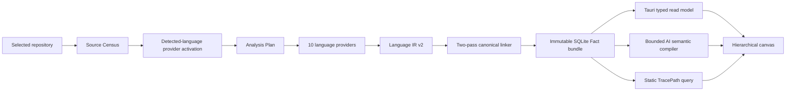

# Runtime architecture

Status: canonical-only code vertical slice, 2026-08-09.

Analysis scope and producer ownership are normative in
[`analysis-product-boundary.md`](analysis-product-boundary.md). This document
describes how that fixed product boundary is implemented; it does not expand it.

Codebase Workspace turns a selected local repository into one evidence-backed
hierarchical map. The product supplies information quickly; it does not add
onboarding, impact-analysis, API-design, or refactoring “modes”. Users interpret
the same map for their own work.

## End-to-end ownership

The Fact Graph is authoritative. AI areas, names, summaries, and explanations
are replaceable derived revisions. An AI failure cannot invalidate or replace
the last verified static snapshot.

## Static engine

`code-memory-language index` owns one pipeline:

1. Source Census streams complete source bytes, hashes them, and records
   explicit excluded or non-enumerated scopes.
2. The desktop activates only the signed provider packs needed by that exact
   manifest. The validated preflight manifest is reused by `index`, so provider
   selection does not add a third source scan. Packs are atomically appended
   once to a catalog-digest-addressed app-data store; different repository
   language combinations reuse the same verified pack bytes instead of
   creating selection-specific copies.
3. Analysis Plan assigns every included language file to compiler/package/TU
   boundaries.
4. The resource-weighted scheduler runs provider shards without changing plan
   ownership.
5. Direct adapters reconcile provider output with exact source inventories and
   emit one validated Language IR v2 authority. File-local AST inventories run
   in a CPU- and memory-bounded pool and are merged back in repository-path
   order; record serialization reuses a bounded buffer. The adapter coordinator
   delegates definition reconciliation, relation classification, receipt data
   contracts, source inventory, and artifact writing to separate modules. These
   modules do not own scheduling or canonical publication, so extraction rules
   still have one direction and cannot form a second pipeline.
6. The linker reads the Language IR in two parsed passes: the first ingests
   receipts/evidence and registers definition identities, including valid
   forward evidence references; the second resolves evidence-backed
   relations. The SQLite staging store keeps a compact source-evidence index
   so identity and path checks do not deserialize the full evidence payload.
   It then deduplicates, prunes visualization-irrelevant details, and verifies
   graph invariants.
7. The store fsyncs an immutable content-addressed SQLite bundle and completion
   manifest, then emits the canonical receipt.

The removed `language-index`, `architecture-index`, and `collection-report`
formats have no runtime path. Provider DTOs and Language IR JSONL are bounded
job staging and are cleaned after publication.

### Sidecar identity and development startup

The code sidecar publishes a machine-readable CLI contract. The desktop adapter
and bundled manifest require contract v4, which includes `contract`, `list`,
`doctor`, `detect-languages`, and `index` and excludes the removed collector and
JSON-index commands. Contract v4 also requires the explicit `index
--cache-policy reuse|fresh` execution policy. `npm run dev:desktop` first performs a pinned, locked,
incremental release build, probes that contract, atomically stages the verified
executable under `src-tauri/engines`, and updates its development checksum.
Debug runtime resolution points directly at that staged directory; Cargo
`target/debug/engines` and `target/release/engines` copies are not runtime
authorities. Production still resolves only packaged resources verified during
the build.

### Static trust rules

- Similar names and nearby directories never resolve a relation.
- Confirmed and static-candidate relations require exact source evidence.
- Unknown or unmeasured behavior is a gap/coverage record, never an edge.
- Compile/project context participates in identity and cache keys.
- A source change during analysis rejects the mixed generation.
- Identical source/config/provider input produces identical semantic and bundle
  digests.

## Desktop publication and querying

`src-tauri/src/analysis.rs` starts one analysis operation per workspace. One
operation ID is passed to the static sidecar and every semantic child process.
Cancellation therefore stops the complete analysis, including parallel AI
partitions. A cancellation before canonical publication preserves the previous
static snapshot; a semantic-provider failure after canonical publication keeps
the newly verified static snapshot and publishes no semantic revision for it.

The header action is deliberately named `재분석` and sends
`cachePolicy: "fresh"` through the desktop boundary. Fresh analysis bypasses
every completed-result cache owned by the product: TypeScript project model,
language-provider batches, framework analysis, current semantic revision, and
verified semantic partitions. It still reuses installed/signed provider
toolchains because those are dependencies, not prior analysis answers. Newly
verified derivative caches are atomically refreshed for a later warm run. The
currently published Fact and semantic pointers stay readable while reanalysis
runs and are swapped only after their respective new outputs pass validation;
cancel or failure therefore cannot turn a usable map into an empty screen.
Immutable semantic record filenames include both semantic revision identity
and payload digest. Thus a fresh run may retain the same map identity while
changing non-semantic warning text without colliding with an earlier record.

The desktop validates the artifact schema, completion manifest, SQLite digest,
known tables, typed rows, references, and counts before copying it into
app-owned immutable storage and swapping the workspace pointer. It never writes
inside the selected repository.

`src-tauri/src/fact_graph.rs` serves fixed SQLite queries. Interactive map
overview, selection nodes, evidence, and bounded TracePath inputs are read by
key and limit; a click no longer materializes all node/edge/evidence tables or
caches two complete snapshots in memory. Semantic planning materializes the
structural node/edge/coverage tables needed for ownership and TracePath, then
fetches only evidence IDs referenced by the bounded final anchor set. The old
full-evidence snapshot API has no runtime path. A small verification-digest
cache avoids repeating immutable bundle verification and is invalidated by the
published pointer identity.

Source navigation resolves repository-relative evidence below the selected
root, rejects path escape/reparse traversal, and opens an exact file/line in a
supported local editor. Deleting a workspace removes only app-owned workspace,
Fact, and semantic data; the source repository is explicitly preserved.

## Static TracePath

TracePath is a query over canonical facts, not a second stored graph. It follows
source-backed execution-oriented relations with exact direction:

- direct `Calls` and `Constructs`;
- resolved `virtual`, `interface`, and `dynamic` calls as candidate hops that
  force the path to `gap`;
- route-to-handler order derived from exact `Handles` direction;
- bounded continuation through known callable/service nodes.

Containment, import, type, test, unknown dispatch, legacy calls without an
execution occurrence, and deferred callbacks cannot become immediate execution
arrows. Partial paths and non-direct dispatch remain visible with
gap/cycle/depth-limit status instead of being presented as complete.

The frontend selection contract receives ordered nodes and ordered hops. Each
hop includes relation identity, truth, dispatch, exact evidence path/line, and
the source occurrence (`lexicalOrdinal`, `guarded`, `repeated`, `deferred`,
`awaited`). Area selection recomputes bounded paths from the area's static
API/entrypoint anchors so paths may cross semantic-area boundaries; it does not
truncate execution to AI citation membership.

## AI semantic boundary

AI receives a bounded, provider-neutral projection of the verified Fact Graph.
Before the first run for a workspace/provider pair, the UI explicitly discloses
that selected source excerpts cross the configured CLI boundary. Excerpts are
secret-redacted before packet compilation, and the broker refuses to start a
provider process if applying the redactor again would change any excerpt. This
keeps packet identity/cache keys tied to exactly the sanitized bytes sent to
the provider.

It may:

- group existing static regions into L0/L1 semantic areas;
- name and summarize those areas;
- assign only supplied Fact/Region IDs;
- cite supplied evidence and relation IDs;
- abstain and keep structural names when evidence is weak.

AI may not create static nodes, alter endpoints, reorder an execution path,
calculate source counts, change truth class, or hide coverage. Output is
schema-validated and referentially checked before an immutable semantic
revision is published. A trace can represent an area only when every region
that owns the trace belongs to that area's direct or descendant membership;
cross-area traces remain relationship information rather than area evidence.
Semantic failure never rolls back the canonical Fact pointer. Map queries also
require snapshot identity equality, so an older semantic revision cannot be
rendered over a newer static snapshot.

Large semantic inputs use adaptive, disjoint local Map jobs. The planner derives
the partition shape from the complete prompt byte size, static region count,
and the per-request safety budget; it does not target a fixed job count. Each
local result is verified independently against its exact region scope. Local
verification enforces packet identity, hierarchy references, exact-one region
accounting, evidence ownership, and honest fallback tuples, but deliberately
defers sibling-label uniqueness: subsetting may promote unrelated descendants
to temporary local roots, and local results are never published. Structural
fallback labels may also remain equal because they must copy the supplied
structural label exactly. The final full-map verifier requires distinct sibling
labels for evidence-backed semantic areas. After all partitions pass, one compact global coordinator receives only short region
aliases, structural summaries, verified local area hints, and selected boundary
counts. It may merge responsibilities across partition boundaries, but it never
receives or emits canonical fact, evidence, or trace IDs. Deterministic code maps
the aliases back to canonical regions, attaches only eligible citations and
traces, and runs the ordinary full-packet verifier before publication. This
avoids the former fan-in Reduce tree without degrading L0/L1 into partition-local
hierarchies.

Provider concurrency is also calculated at runtime from the current job count,
logical CPU count, and available memory. Optional environment values are safety
caps only; they cannot turn the adaptive scheduler into a larger fixed pool.
Scheduler telemetry records the inputs and selected worker count for every run.
The post-provider Language IR inventory uses the same principle: units with at
least 32 files may use up to eight file workers, but the cap is reduced from
available memory and the largest planned source file. Serial and parallel paths
must produce identical stream, semantic, and artifact digests.
All provider calls are ephemeral: they do not resume or create the user's
Codex/Claude chat session. The semantic cache key includes Fact digest,
prompt/schema version, provider/model, and reasoning effort so identical
approved input remains stable. When a provider
returns a schema-valid but unverifiable result, the broker sends that rejected
JSON and the exact verifier error through a bounded repair prompt. For
hierarchy/reference failures it also enumerates every safely detectable
violation of the same invariant from the rejected object, because the strict
verifier itself is fail-fast. If one repair exposes a later validation error,
the latest rejected object may receive one final targeted repair together with
the earlier verifier errors so the provider cannot silently regress a prior
fix. Set-like aliases, citation IDs, and warnings are sorted and deduplicated by
deterministic code rather than consuming an AI repair. The structured-output
schema pins `snapshotId` and `semanticInputDigest` to the exact request values,
while the verifier checks them again at publication. Semantic
analysis is never restarted and repair is capped at two provider calls. Every
complete corrected object must pass the same verifier. Only an execution
failure with no result retries the exact prompt that failed.

## UI boundary

The React/Fluent 2 workbench contains one project list, one hierarchical canvas,
and one inspector/conversation rail. It renders static facts and approved
semantic revisions; it does not infer relation truth in the browser.

Relation encodings remain distinct:

- confirmed: evidence-backed primary connector;
- structural: containment/composition encoding;
- static candidate: evidence-backed uncertain connector;
- unknown/unmeasured: no connector, shown through coverage/gap UI.

Model selection stores an exact `{ provider, model, effort }` tuple. Existing
workspaces without effort default to `high`. The broker resolves and pins one
installed compatible CLI runtime for the analysis boundary.

The canvas is sized from the published layout rather than a fixed viewport.

### Semantic map read model

The desktop map endpoint preserves semantic and quality metadata instead of
asking the frontend to infer it from labels, colours, or the number of visible
cards:

- `MapArea.category` is the verifier-approved semantic category (`domain`,
  `shared`, `infrastructure`, `integration`, or `structural`).
- `MapArea.labelSource` says whether the displayed name is a verified semantic
  label or a retained structural label. `fallbackReason` explains why a
  structural label was required; the frontend must not infer either field from
  `category` or the spelling of the label.
- `MapNode.definition` is projected only from the canonical node's exact
  `definitionEvidenceId`. An incoming call-site location is evidence for the
  caller and must never be shown as the target node's definition.
- `MapArea.boundaryRelationCounts` counts canonical relation records with
  exactly one endpoint in the area's effective member regions, split into
  `verified`, `structural`, and `candidate`. Relations wholly inside the area
  are excluded.
- `MapArea.affectingAnalysisGapCount` counts canonical gap records whose
  declared file, repository, analysis-unit, or native-symbol scope overlaps the
  area's effective member regions. A gap may affect both a parent and child, so
  these values are not additive.
- `MapView.unattributedAnalysisGapCount` retains workspace-wide gaps and gaps
  that cannot be assigned to any published area. They must not be converted to
  a false area-level zero.
- `MapSelection.analysisGaps` returns the deterministic gap total for the
  selected scope, the first 16 stably ordered `{ code, capability, message }`
  records, and the exact truncated count. Area selections reuse canonical
  file/unit/repository attribution. A raw fact selection requires matching
  evidence or scope; symbol names are never used to guess attribution.

These fields have different denominators and must be labelled separately in
the UI. In particular, the number of visible or hidden map nodes is not an
evidence, confirmed-relation, or gap count.

### Canvas input boundary

On Windows, the main WebView enables native pinch recognition so Chromium can
offer precision-touchpad pinch updates to the page as cancelable `ctrl+wheel`
events. The canvas owns those events with a non-passive window listener:

- a pinch over the map zooms around the pointer;
- ordinary two-finger scrolling over the map pans it;
- a pinch outside the map is consumed without scaling the application shell;
- browser page-zoom keyboard shortcuts are suppressed while the map is mounted.

Do not add Chromium's `--disable-pinch` switch as a substitute. That switch
disables compositor pinch recognition before the application can translate the
gesture into canvas zoom.
Top-level areas without saved reader positions are packed deterministically
using their projected width and content height; the column count expands with
the area count. Fit-to-screen may zoom out to 5% for very large repositories.
Below the detail threshold the same map becomes a responsibility overview:
area identity, child count, item count, and relationships remain visible while
member chains and relation labels are deferred until zoom-in. This is semantic
zoom, not a second product mode, and it does not change graph membership or
truth.

Analysis progress is deliberately stage-scoped. The UI shows the current
stage, the engine's exact label/work count, elapsed wall time, and cancellation;
it never presents one stage's ratio as an end-to-end completion percentage or
claims an unmeasured ETA. Reanalysis leaves the prior published map visible
with a compact status overlay. Long failures render a bounded summary with
collapsed technical detail so diagnostics remain available without replacing
the workbench.

## Surviving components

- `src/`: Fluent desktop shell and typed canvas/inspector.
- `src-tauri/src/analysis.rs`: workspace operation, progress, cancellation,
  canonical receipt import.
- `src-tauri/src/fact_graph.rs`: immutable bundle validation and query-backed
  read model.
- `src-tauri/src/static_query/`: bounded exact graph queries.
- `src-tauri/src/semantic/`: partitioned AI broker, verifier, revision store,
  and map projection.
- `src-tauri/src/source.rs`: safe evidence navigation.
- `crates/fact-model/`: provider/UI/AI-independent static contracts.
- `crates/semantic-model/`: provider-neutral semantic contracts.
- `crates/semantic-compiler/`: prompt, schema, canonicalization, and verifier.
- `code_memory/`: ten-language static code engine.
- `db_memory/`: separate metadata-only DB engine; not yet part of this code
  vertical slice.

## Non-negotiable invariants

1. A confirmed edge has existing endpoints and valid evidence.
2. Unknown is never converted into zero, confirmed, or a line.
3. Failure/cancellation never replaces the last published snapshot.
4. AI cannot mutate static identity, evidence, truth, coverage, or path order.
5. Large-project queries are bounded and disclose omissions.
6. The product exposes one map rather than purpose-specific modes.
7. The original repository is read-only from the product's perspective.
8. Only one canonical graph representation crosses the engine/desktop
   boundary.

## Remaining completion work

- measure and optimize cold analysis on representative large repositories;
- measure hierarchical Reduce quality, latency, and provider cost on S/M/L
  repositories and add immutable intermediate-result caching;
- finish real-repository holdouts for every supported language;
- integrate DB metadata through its own canonical typed adapter;
- connect grounded app-owned conversation after map correctness and latency are
  accepted.
