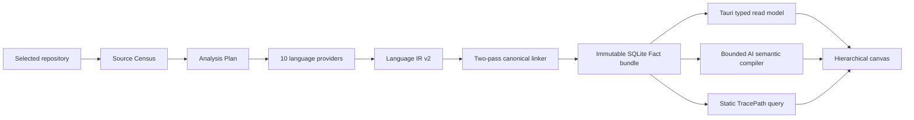

# Runtime architecture

Status: canonical-only code vertical slice, 2026-08-09.

Codebase Workspace turns a selected local repository into one evidence-backed
hierarchical map. The product supplies information quickly; it does not add
onboarding, impact-analysis, API-design, or refactoring “modes”. Users interpret
the same map for their own work.

## End-to-end ownership

The Fact Graph is authoritative. AI areas, names, summaries, and explanations
are replaceable derived revisions. An AI failure cannot invalidate or replace
the last verified static snapshot.

## Static engine

`code-memory-language index` owns one pipeline:

1. Source Census streams complete source bytes, hashes them, and records
   explicit excluded or non-enumerated scopes.
2. Analysis Plan assigns every included language file to compiler/package/TU
   boundaries.
3. The resource-weighted scheduler runs provider shards without changing plan
   ownership.
4. Direct adapters reconcile provider output with exact source inventories and
   emit one validated Language IR v2 authority.
5. The linker registers identities, resolves evidence-backed relations,
   deduplicates, prunes visualization-irrelevant details, and verifies graph
   invariants.
6. The store fsyncs an immutable content-addressed SQLite bundle and completion
   manifest, then emits the canonical receipt.

The removed `language-index`, `architecture-index`, and `collection-report`
formats have no runtime path. Provider DTOs and Language IR JSONL are bounded
job staging and are cleaned after publication.

### Static trust rules

- Similar names and nearby directories never resolve a relation.
- Confirmed and static-candidate relations require exact source evidence.
- Unknown or unmeasured behavior is a gap/coverage record, never an edge.
- Compile/project context participates in identity and cache keys.
- A source change during analysis rejects the mixed generation.
- Identical source/config/provider input produces identical semantic and bundle
  digests.

## Desktop publication and querying

`src-tauri/src/analysis.rs` starts one analysis operation per workspace. One
operation ID is passed to the static sidecar and every semantic child process.
Cancellation therefore stops the complete analysis, including parallel AI
partitions, while preserving the previously published revision.

The desktop validates the artifact schema, completion manifest, SQLite digest,
known tables, typed rows, references, and counts before copying it into
app-owned immutable storage and swapping the workspace pointer. It never writes
inside the selected repository.

`src-tauri/src/fact_graph.rs` serves fixed SQLite queries. Interactive map
overview, selection nodes, evidence, and bounded TracePath inputs are read by
key and limit; a click no longer materializes all node/edge/evidence tables or
caches two complete snapshots in memory. The semantic compilation job may read
one verified snapshot to construct its bounded global projection; replacing
that one-shot build with streaming partitions is separate scale work. A small
verification-digest cache avoids repeating immutable bundle verification and
is invalidated by the published pointer identity.

Source navigation resolves repository-relative evidence below the selected
root, rejects path escape/reparse traversal, and opens an exact file/line in a
supported local editor. Deleting a workspace removes only app-owned workspace,
Fact, and semantic data; the source repository is explicitly preserved.

## Static TracePath

TracePath is a query over canonical facts, not a second stored graph. It follows
only confirmed execution-oriented relations with exact direction:

- direct `Calls` and `Constructs`;
- route-to-handler order derived from exact `Handles` direction;
- bounded continuation through known callable/service nodes.

Containment, import, type, test, candidate, virtual/interface dispatch, and
unknown targets cannot become execution arrows. Partial paths remain visible
with gap/cycle/depth-limit status instead of being presented as complete.

## AI semantic boundary

AI receives a bounded, provider-neutral projection of the verified Fact Graph.
It may:

- group existing static regions into L0/L1 semantic areas;
- name and summarize those areas;
- assign only supplied Fact/Region IDs;
- cite supplied evidence and relation IDs;
- abstain and keep structural names when evidence is weak.

AI may not create static nodes, alter endpoints, reorder an execution path,
calculate source counts, change truth class, or hide coverage. Output is
schema-validated and referentially checked before an immutable semantic
revision is published.

Large semantic inputs are deterministically partitioned into independent local
jobs and a source-free global reconciliation job. These calls are ephemeral:
they do not resume or create the user's Codex/Claude chat session. The semantic
cache key includes Fact digest, prompt/schema version, provider/model, and
reasoning effort so identical approved input remains stable.

## UI boundary

The React/Fluent 2 workbench contains one project list, one hierarchical canvas,
and one inspector/conversation rail. It renders static facts and approved
semantic revisions; it does not infer relation truth in the browser.

Relation encodings remain distinct:

- confirmed: evidence-backed primary connector;
- structural: containment/composition encoding;
- static candidate: evidence-backed uncertain connector;
- unknown/unmeasured: no connector, shown through coverage/gap UI.

Model selection stores an exact `{ provider, model, effort }` tuple. Existing
workspaces without effort default to `high`. The broker resolves and pins one
installed compatible CLI runtime for the analysis boundary.

## Surviving components

- `src/`: Fluent desktop shell and typed canvas/inspector.
- `src-tauri/src/analysis.rs`: workspace operation, progress, cancellation,
  canonical receipt import.
- `src-tauri/src/fact_graph.rs`: immutable bundle validation and query-backed
  read model.
- `src-tauri/src/static_query/`: bounded exact graph queries.
- `src-tauri/src/semantic/`: partitioned AI broker, verifier, revision store,
  and map projection.
- `src-tauri/src/source.rs`: safe evidence navigation.
- `crates/fact-model/`: provider/UI/AI-independent static contracts.
- `crates/semantic-model/`: provider-neutral semantic contracts.
- `crates/semantic-compiler/`: prompt, schema, canonicalization, and verifier.
- `code_memory/`: ten-language static code engine.
- `db_memory/`: separate metadata-only DB engine; not yet part of this code
  vertical slice.

## Non-negotiable invariants

1. A confirmed edge has existing endpoints and valid evidence.
2. Unknown is never converted into zero, confirmed, or a line.
3. Failure/cancellation never replaces the last published snapshot.
4. AI cannot mutate static identity, evidence, truth, coverage, or path order.
5. Large-project queries are bounded and disclose omissions.
6. The product exposes one map rather than purpose-specific modes.
7. The original repository is read-only from the product's perspective.
8. Only one canonical graph representation crosses the engine/desktop
   boundary.

## Remaining completion work

- measure and optimize cold analysis on representative large repositories;
- split large semantic reconciliation hierarchically beyond the current
  bounded global packet;
- finish real-repository holdouts for every supported language;
- integrate DB metadata through its own canonical typed adapter;
- connect grounded app-owned conversation after map correctness and latency are
  accepted.
