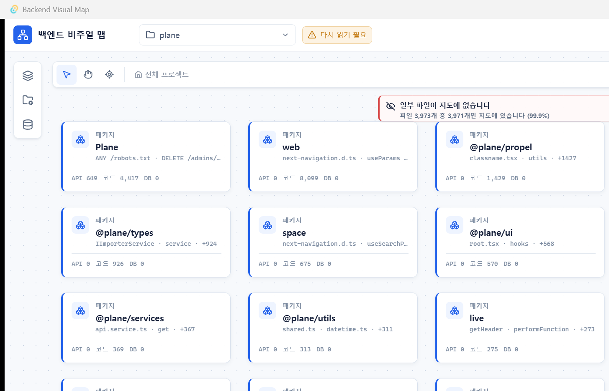
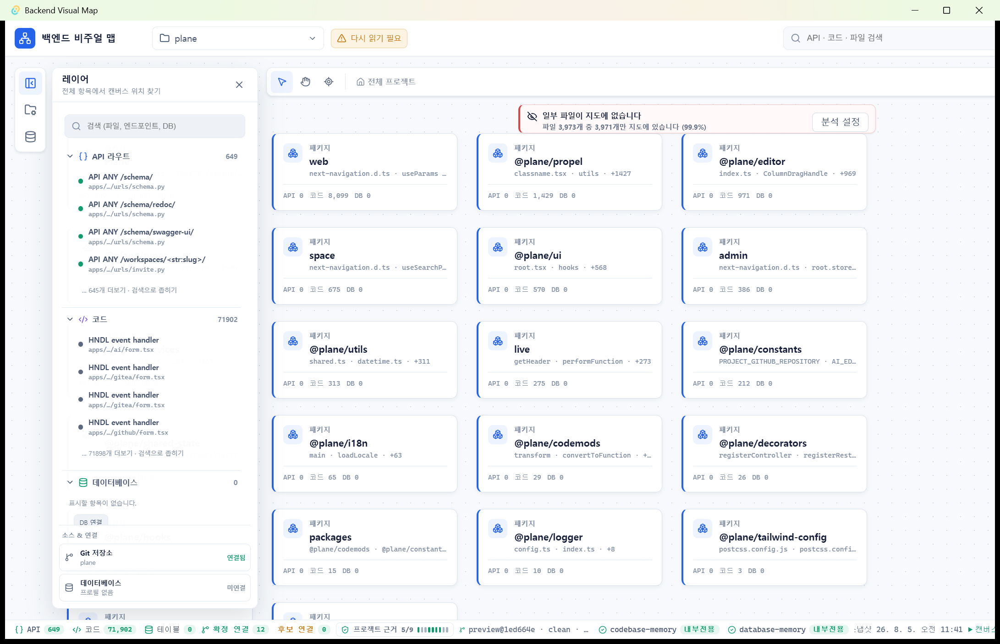
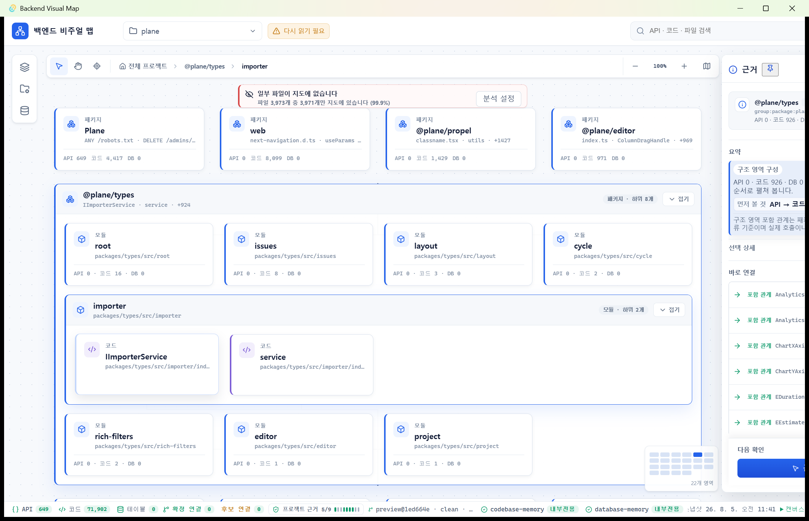

# Visual Map 엔진·UI POC 검증 보고서 — 2026-08-05

기준 commit: `340be023dc226b597e6f12016b70a6aeb78cb5af` + 현재 branch의 저장 구조 패치
branch: `agent/local-first-optimization`
운영체제: Windows 11 x64
Rust: `1.96.1`
Node.js: `24.18.0`
npm: `11.16.0`
Docker: `29.6.1`

## 결론

현재 상태는 Demo 1.0 후보이며 엔진 완성으로 판정하지 않는다.

- 12개 active 언어 provider는 실제 저장소에서 실행됐다.
- 파일·심볼·직접 호출 공통 core는 동작한다.
- route → handler 품질은 framework마다 크게 다르다.
- SQLite와 일반 PostgreSQL 16 metadata POC는 통과했다.
- PostgreSQL `SERIAL/BIGSERIAL`은 authoritative snapshot을 실패시키는 P0 결함이 있다.
- 코드 엔진의 앱 저장 경로는 단일 대형 JSON에서 512행 압축 청크 SQLite와 불변
  generation으로 전환됐다.
- Tauri 통합 snapshot도 압축 청크 SQLite이며 검색은 전체 snapshot을 읽지 않고 얇은
  index와 필요한 청크만 사용한다.
- Tauri 통합과 한 캔버스 단계별 펼침 UI는 동작한다.
- 대형 분석 중 메모리 materialization, Dart monorepo scheduling, 과거 전역 cache의
  일회성 정리가 남았다.

## 증거 위치

원시 결과는 저장소에 복사하지 않았다. 대형 JSON과 provider cache를 Git에 넣지 않기
위해서다.

```text
D:\visual_map_reliability_lab\_results\poc-audit-20260805-1430
D:\visual_map_reliability_lab\_results\storage-poc-20260805-final
D:\visual_map_reliability_lab\_results\storage-poc-20260805-chunked
```

각 성공한 코드 POC 디렉터리에는 다음이 있다.

```text
language-index.json
architecture-index.json
stdout.log
stderr.log
cache\VisualMap\cache\code-memory\...
```

첫 경로는 기존 언어·DB 품질 audit다. 뒤의 두 경로는 최종
`code-memory.graph-store.v3` 저장 POC다. 각 저장 POC에는 cold/warm args, stdout,
stderr, 두 generation과 `storage-summary.json`이 있다. 대형 원시 결과는 Git에 넣지
않았다.

UI 캡처 세 장은 문서 재현성을 위해 `docs/assets/poc-2026-08-05`에도 보존했다.

## 코드 엔진 POC

공통 실행 형태:

```powershell
& .\src-tauri\engines\code-memory-language.exe index `
  --root <pinned-repository> `
  --out <receipt>\language-index.json `
  --architecture-out <receipt>\architecture-index.json `
  --packs-root .\code_memory\packs `
  --providers-root .\code_memory\providers
```

아래 `HANDLES`는 `language-index.json.framework_relations[kind=HANDLES]`, Endpoint는
`architecture-index.json.nodes[kind=ENDPOINT]`를 직접 집계했다. 시간은 audit 실행의
wall-clock 관찰값이다.

| POC                           | pinned commit | 파일 coverage                            |  문서 |    관계 |  CALLS | Endpoint | HANDLES |   시간 | 판정               |
| ----------------------------- | ------------- | ---------------------------------------- | ----: | ------: | -----: | -------: | ------: | -----: | ------------------ |
| TypeScript / NestJS           | `549cc37a`    | JS 6/6, TS 182/182                       |   188 |   4,122 |    652 |       24 |      24 |   6.6s | 통과               |
| Python / FastAPI              | `546f1846`    | Python 47/47, TS 95/95                   |   142 |   3,006 |    793 |       23 |      23 |  20.5s | 통과               |
| Java / Spring                 | `305a1f13`    | Java 62/62, JS 22/22                     |    84 |     196 |    148 |       16 |      16 |  70.4s | 통과, 느림         |
| C# / CleanArchitecture        | `43831e20`    | C# 108/110, JS 18/18, TS 25/25           |   151 |   2,257 |    690 |       10 |      10 |  28.2s | 통과               |
| C++ / Drogon                  | `4afafe03`    | C 10/10, C++ 19/20, JS 1/1, TS 25/25     |    46 |     614 |    105 |       10 |       4 |  14.1s | handler 부분       |
| Go / SimpleBank               | `97f000fe`    | Go 76/77, JS 5/7, TS 8/8                 |    89 |   3,839 |  3,209 |       13 |      12 |  38.1s | 부분 통과          |
| JavaScript / Ghost            | `ee552972`    | JS 3,096/3,097, TS 2,454/2,454           | 5,550 | 177,570 | 89,751 |      340 |       4 | 266.2s | route binding 취약 |
| C / curl                      | `6f39c854`    | C 377/892, C++ 182/265, Python 52/52     |   430 |   2,976 |  2,888 |        0 |       0 |  98.9s | build/header 부분  |
| Rust / Vaultwarden            | `2629bcbe`    | Rust 62/62, JS 9/9, Python 1/1, TS 22/22 |    94 |   2,721 |  1,848 |      305 |     210 |  20.6s | handler 부분       |
| PHP / Bagisto                 | `95872d4c`    | PHP 2,591/2,591, JS 37/37                | 2,628 |  12,611 |  6,075 |       14 |      12 | 133.0s | source-only 부분   |
| Ruby / Redmine                | `1496a3ba`    | Ruby 1,120/1,120, JS 129/129, Python 1/1 | 1,250 |   2,494 |  1,762 |    1,221 |     834 |  51.2s | handler 부분       |
| Dart / Serverpod auth package | `3a6e8460`    | Dart 16/16                               |    16 |      19 |      2 |       13 |      11 |   8.5s | 소형 통과          |

`x/y`는 indexed/found다. 차이는 `excluded`이며 `missing`과 구분했다.

### 대형 저장소에서 확인한 사실

Ghost cold 결과:

```text
language-index.json       306,720,965 bytes
architecture-index.json    24,567,877 bytes
architecture nodes              11,006
architecture edges              21,341
```

같은 설정의 hot run:

```text
cached TypeScript/JavaScript project model
scheduler providers jobs=0 max_parallel=1 max_weight=4 memory_budget_mb=12271
timing stage=provider_merge elapsed_ms=18415 documents=5550 relations=177570 diagnostics=44
cached framework analysis
timing stage=architecture_and_json elapsed_ms=209 cached=true
```

provider 재실행은 0건이고 cold 대비 약 91.6% 빨라졌지만 전체 wall time은 약 22.4초다.
300MB 결과를 읽고 병합하는 비용이 hot-run 하한으로 남았다. cold/hot architecture 파일의
SHA-256은 같았다. 이 수치는 저장 구조 변경 전 기준선이며, persistent JSON 문제는 아래
`로컬 저장 구조 POC`에서 해결됐다. 전체 결과를 메모리에서 구성하는 비용은 남아 있다.

Redmine `language-index.json`도 `271,903,561 bytes`다. public interchange JSON의 필드를
누락하지 않고, 앱 hot path만 chunked SQLite로 바꿨다.

### Dart 전체 monorepo 실패 POC

전체 Serverpod root는 완료 결과가 없다. 성공으로 집계하지 않았다.

```text
scheduler providers jobs=78 max_parallel=4 max_weight=4 memory_budget_mb=12029
progress providers: 35% -> 37%
```

운영 POC 시간 안에 끝나지 않아 중단했다. 작은 auth package 통과는 전체 monorepo 통과를
의미하지 않는다.

### C/C++ 진단 해석

curl은 C 515개, C++ 83개가 dependency/compile context 범위에서 제외됐고 진단은
1,413건이다. Drogon 로그에는 실제로 다음이 반복됐다.

```text
[provider:clangd] IncludeCleaner: Failed to get an entry for resolved path
from include <drogon/orm/Mapper.h>: No such file or directory
```

파일 inventory와 framework route 일부는 유효하지만 전체 native semantic coverage로
판정하지 않는다.

## 코드·DB·Tauri 회귀 테스트

| 명령                                                              | 결과                                                  |
| ----------------------------------------------------------------- | ----------------------------------------------------- |
| `cargo test --locked --manifest-path code_memory/rust/Cargo.toml` | 211 passed, 0 failed                                  |
| `cargo test --locked --manifest-path db_memory/Cargo.toml`        | 182 passed, 0 failed, 27 ignored live tests           |
| `cargo test --locked --manifest-path src-tauri/Cargo.toml`        | 288 passed, 0 failed, 5 ignored (293 total)           |
| `npm test -- --run`                                               | 30 files, 169 tests passed                            |
| `npm run typecheck`                                               | passed                                                |
| `npm run lint`                                                    | passed                                                |
| `npm run deadcode`                                                | passed, frontend dead code 0                          |
| `npm run build`                                                   | passed                                                |
| `npm run verify:engines`                                          | bundled development artifacts and SHA-256 passed      |
| `npm run smoke:rdb`                                               | CLI/SQLite DDL/inventory/describe/impact/trace passed |

ignored live test는 실행하지 않았는데 통과한 것으로 세지 않는다. 이번 audit에서 별도로
선택 실행한 Tauri ignored POC는 다음 두 건이다.

- 실제 FastAPI 저장소의 code sidecar → SQLite generation 직접 읽기 → snapshot 병합
  통과, 정적 import call 3건 확인
- 실제 SQLite DDL DB sidecar → Tauri v2 snapshot 왕복 통과

Windows에서 280자를 넘는 경로를 실제로 만들어 코드 generation SQLite, DB graph
store와 SQLite source, Tauri snapshot SQLite를 각각 쓰고 다시 읽는 회귀 테스트도
통과했다.

## 로컬 저장 구조 POC

앱이 사용하는 production command를 직접 실행했다.

```powershell
code-memory-language.exe cli index_repository --args-file <utf8-no-bom-json>
```

최종 형식:

```text
code-memory.generation-receipt.v1
code-memory.graph-store.v3
512-row GZip chunks + thin SQLite indexes
current + previous complete generation
```

| 저장소 | run | 시간 | engine 부모 peak working set | generation SQLite | 노드 / CALLS / HANDLES |
| --- | ---: | ---: | ---: | ---: | ---: |
| SimpleBank | cold | 50.222s | 202,199,040 B | 5,939,200 B | 25,048 / 3,209 / 12 |
| SimpleBank | warm | 7.354s | 193,761,280 B | 5,939,200 B | 25,048 / 3,209 / 12 |
| Plane | cold | 57.116s | 1,154,818,048 B | 95,711,232 B | 76,597 / 12,148 / 620 |
| Plane | warm | 11.302s | 1,136,390,144 B | 95,711,232 B | 76,597 / 12,148 / 620 |

각 저장소의 cold/warm 논리 count는 완전히 같았다. 두 실행 뒤 검사 결과도 동일했다.

```text
complete generations  2
staging directories   0
legacy result JSON     0
```

Plane의 최초 SQLite row-JSON 형식은 `147,390,464 bytes`였고 최종 512행 압축 청크
형식은 `95,711,232 bytes`다. 같은 논리 count에서 **35.1% 감소**했다. 두 generation과
runtime cache를 합친 store는 `312,316,729`에서 `208,944,185 bytes`로 **33.1%
감소**했다.

SimpleBank 최종 store는 두 generation과 runtime cache를 포함해 `14,570,207 bytes`다.
Java/Spring POC에서 runtime cache가 약 `205 MB`였지만 이를 보존한 결과 warm run은
103.040초에서 1.099초로 줄었다. 이는 JDTLS workspace이므로 무조건 삭제할 대상이
아니며 current/previous generation GC와 별개다.

측정의 `engine_peak_working_set_bytes`는 부모 엔진 프로세스만 포함하며 provider child
process 전체 사용량은 아니다. Plane warm run도 약 1.06 GiB를 사용하므로 persistent
storage 문제는 해결됐지만 in-process 전체 결과 materialization은 아직 해결되지 않았다.

## DB 엔진 POC

### SQLite native

```json
{
  "snapshot_key": "sqlite:poc-sqlite",
  "authority": "complete",
  "server_version": "3.46.0",
  "objects": 9,
  "relationships": 8
}
```

영수증: `db-sqlite-native-cache.sqlite`

### PostgreSQL 16 — 일반 BIGINT schema

```json
{
  "snapshot_key": "postgres:poc-postgres16-plain",
  "authority": "complete",
  "server_version": "16.14 (Debian 16.14-1.pgdg12+1)",
  "objects": 65,
  "relationships": 123
}
```

검증 범위에는 table 3, column 12, constraint 8, index 5, view 1, trigger 1,
routine 1, enum value 3이 포함됐다. 영수증은 `db-postgres16-plain-cache.sqlite`다.

### PostgreSQL 16 — SERIAL schema 실패

```text
duplicate canonical metadata relationship USES_SEQUENCE:
...column:users:id->...sequence:users_id_seq
exit-code=1
```

실패 후 snapshot은 0개다. 재현 조건, catalog 원문과 코드 위치는
[PG-SERIAL-001](../troubleshooting/code-memory-engine.md#pg-serial-001--postgresql-serialbigserial이-전체-snapshot을-실패시킴)에
기록했다.

### 이번 audit에서 새로 live 실행하지 않은 DB

다음은 adapter와 테스트가 존재하지만 이번 2026-08-05 POC의 fresh live 통과로 주장하지
않는다.

```text
MySQL
MariaDB
SQL Server
Oracle
YugabyteDB
```

과거 live receipt와 현재 fresh POC를 섞지 않는다. Demo 1.0 release gate에서는 지원
버전별 live matrix를 다시 실행해야 한다.

## Tauri 통합과 규모 POC

검증된 통합 경계:

- code provider 결과와 DB 결과의 snapshot 병합
- `visual-map.snapshot-store.v1` SQLite의 512행 압축 청크, atomic publish, backup recovery
- item/link/architecture 얇은 index와 검색 결과 청크만 선택 해제
- 과거 JSON/ZIP snapshot 읽기와 다음 save 시 SQLite 마이그레이션
- stale source·engine·adapter 판정
- secret redaction과 JSON framing
- timeout, cancel, bounded stdout/stderr
- Windows Job Object process tree 정리
- provider catalog signature와 pack SHA-256
- installer에는 전체 provider pack을 포함하고 분석 시 감지된 언어 pack만 실행

debug projection benchmark:

|    항목 | Overview |   Focus | Composition |
| ------: | -------: | ------: | ----------: |
|  10,000 |    326ms |   235ms |        27ms |
|  50,000 |  1,837ms | 1,256ms |       179ms |
| 100,000 |  4,646ms | 2,755ms |       371ms |

구조적으로 100k 항목을 처리했지만 release build의 실제 UX 예산은 별도 측정해야 한다.

## 배포와 로컬 저장공간

Demo installer:

```text
file    Backend Visual Map_1.0.0-demo.1_x64-setup.exe
bytes   1,172,698,232
sha256  AA549A4FE6E4C841A4DB694606B1D642FE0C4E5655E1D5AB16C3FE07E266F5D5
```

provider ZIP 합계는 `1,143.3 MiB`다. 큰 pack은 dotnet `328.9 MiB`, rust
`178.6 MiB`, ruby `175.9 MiB`, java `128.5 MiB`다. 모든 pack은 installer에
포함되지만 실행 시에는 필요한 언어 pack만 사용한다.

audit PC의 실측:

```text
%LOCALAPPDATA%\VisualMap         6.44 GiB
...\VisualMap\cache             6.14 GiB
largest project cache           1.51 GiB
```

이 수치는 변경 전 전역 경로의 과거 누적분이다. 현재 앱은 신규 코드 캐시와 generation을
다음 workspace 경로에 격리한다.

```text
%LOCALAPPDATA%\VisualMap\workspaces\<workspace-id>\engines\
  codebase-memory\0.1.0\contract-1\cache
```

workspace를 삭제하면 해당 엔진 캐시도 함께 삭제된다. 내부 content-addressed cache와
LSP workspace는 current/previous complete generation에서 참조하지 않으면 GC한다.
`%LOCALAPPDATA%\VisualMap\cache\code-memory`의 과거 전역 데이터는 새 코드가 더 이상
사용하거나 늘리지 않지만 자동 삭제하지 않는다. 사용자가 구버전 rollback에 필요할 수
있는 파일을 무단 삭제하지 않기 위한 결정이다.

## UI/UX POC

실제 Tauri 앱을 실행해 클릭으로 확인했다.







확인된 동작:

- 별도 화면 이동 없이 같은 캔버스에서 패키지 → 모듈 → 코드로 펼침
- 형제 영역과 상위 구조 유지
- 왼쪽 항목 선택이 중앙 화면을 다른 페이지로 바꾸지 않음
- breadcrumb, zoom, minimap, `+N more` 동작
- 좌우 패널 접기 가능

남은 마감:

1. 99.9% 파일 포함 상태도 전체 빨간 경고로 보여 실패처럼 보임
2. `다시 읽기 필요`와 파일 누락 경고가 중복됨
3. 하단 `확정 연결`과 인스펙터 `확정 포함 관계`의 scope가 표시되지 않음
4. 오래된 Plane snapshot이 현재 엔진보다 낮은 품질로 첫인상을 만듦
5. 좌우 패널 동시 표시 시 캔버스와 인스펙터 폭이 부족함

## Demo 1.0 차단 순서

1. **P0:** PostgreSQL `SERIAL/BIGSERIAL` 중복 `USES_SEQUENCE`
2. **P0:** 최신 엔진으로 Plane snapshot 재생성 및 stale 첫 화면 검증
3. **P1:** Ghost/Rust/Rails/C++ route-handler binding
4. **P1:** 대형 결과의 in-process 전체 materialization peak memory
5. **P1:** 실제 장기 사용에서 workspace별 runtime cache 예산 측정
6. **P1:** Dart 전체 monorepo scheduling
7. **P1:** MySQL/MariaDB/SQL Server/Oracle/YugabyteDB fresh live matrix
8. **P2:** UI 경고 우선순위, 연결 scope, inspector 폭

이 목록이 2026-08-05 이후의 구현 우선순위다. 과거 phase 문서의 완료 순서보다 우선한다.
